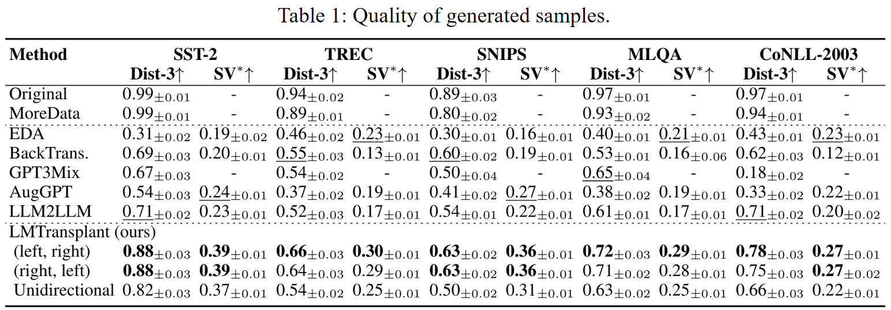
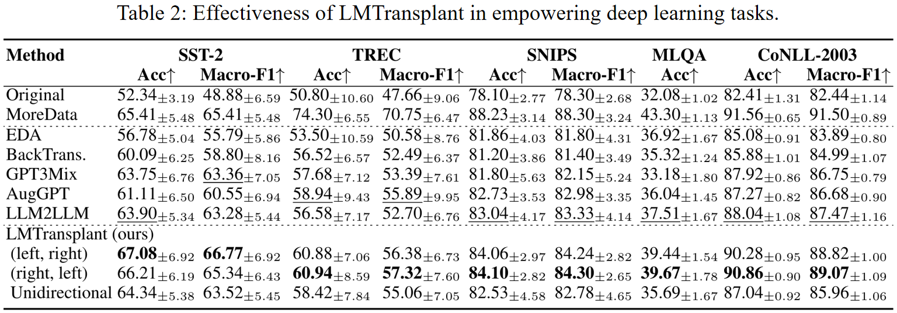

# Left, Right, and Tens of Thousands: A New Paradigm for Text Data Augmentation
This is the PyTorch implementation for the following paper: **Left, Right, and Tens of Thousands: A New Paradigm for Text Data Augmentation**.


## Introduction
This repo provides the code for reproducing the experiments in “Left, Right, and Tens of Thousands: A New Paradigm for Text Data Augmentation”. 
LMTransplant is a novel Data Augmentation method with LLM-based text transplanting. 
It crafts realistic contextual scenarios to the original text, by leveraging external knowledge in LLMs, thereby crafting higher-quality and more diverse text data.


## Overview
We develop LMTransplant, a novel text data augmentation paradigm based on transplantation. Following illustrates the overall pipeline.
LMTransplant generates high-quality and diverse augmented text by leveraging a bidirectional text completion strategy and masked text prediction. 
It generates contextually relevant scenes that align with the original text, making full use of the external knowledge embedded in LLMs. 
We elaborate on each step in the following sections.

<br/>


## Datasets download and preprocessing
We obtain all experimental datasets from publicly available data sources and implement corresponding data preprocessing pipelines tailored to different task types. For text classification datasets, we perform label standardization by converting the original numerical category labels into textual labels. In processing the question-answering datasets, we filter samples based on text length, excluding those that are excessively long or short. All preprocessed data are stored in `.jsonl` file format to facilitate subsequent operations.

```bash
git clone https://anonymous.4open.science/r/LMTransplant-354E/
cd LMTransplant
pip install -r requirements.txt

cd data_augmentation/classification/utils
bash download_and_prepare_datasets.sh

cd data_augmentation
python datasets_preprocess.py
```


## Get seed data
To simulate real-world low-data scenarios and assess the effectiveness of data augmentation methods, we adopt a subsampling strategy similar to existing studies([Kumar et al., 2020](https://arxiv.org/abs/2003.02245); [Ubani et al., 2023](https://arxiv.org/abs/2304.14334)). In the text classification tasks, we perform class-balanced subsampling on the original training and development sets, selecting 10 random samples from each class. In the question-answering task, we randomly subsample 50 samples from the original training and development sets to construct sub-training and sub-development sets.
```bash
cd data_augmentation
python generate_seed_data.py
```


## Generate augmented data
We use LMTransplant to generate augmented data for seed data in the sub-training set.
For a given text, LMTransplant instructs the LLMs to craft its preceding and following contexts through by directional text completion. Subsequently, LMTransplant masks the original text in the transplanted text and directs the LLMs to back fill the missing parts given the crafted contexts, thereby producing new variants of the original text. In this process, the context acts as a bridge between the original and the new text. By incorporating external knowledge through the LLMs, the newly generated text not only preserves semantic similarity to the original but also exhibits greater innovation and diversity.
```bash
cd data_augmentation
python ours_l_r.py
```


## Intrinsic evaluation
We first evaluate the quality of the augmented samples, using two commonly employed metrics, Distinct-n and Semantic fidelity. By more effectively leveraging the external knowledge embedded in LLMs, we expect the samples generated by our method to be semantically related to the original samples, while also being more content-rich, innovative, and demonstrating greater diversity.

#### Distinct-n
```bash
cd data_augmentation/eval_distinct_n
python distinct_3.py
```

#### Semantic fidelity
```bash
cd data_augmentation/classification
bash script_semantic_fidelity/semantic_fidelity_ModernBERT_base.sh
```


## Extrinsic evaluation
We evaluate the improvement in downstream task performance achieved by the augmented samples generated through LMTransplant. 

#### Classification task
```bash
cd data_augmentation/classification
bash script/bert_sst2.sh
```

#### Question answering task
```bash
cd data_augmentation/question_answer
bash 
```


## Main Result
<br/>


<br/>
